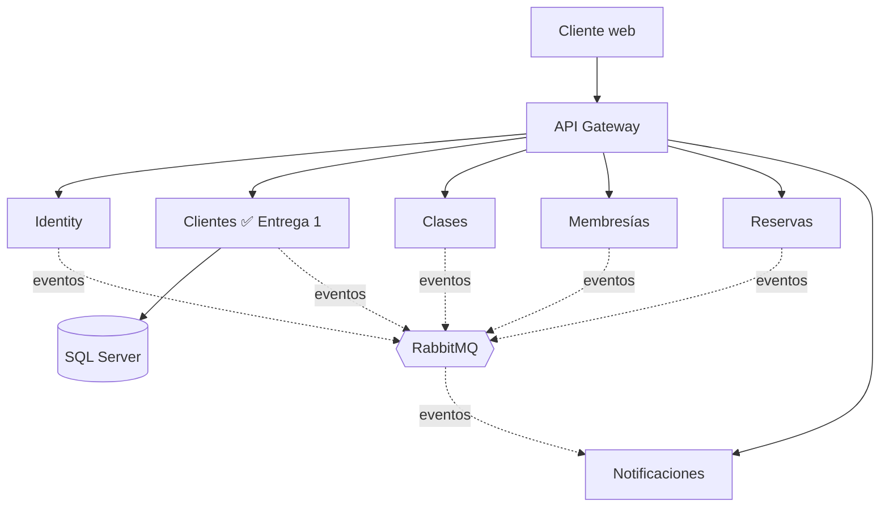
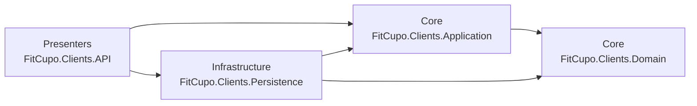

# FitCupo

Plataforma de reservas de clases grupales para un gimnasio, construida con microservicios.
Proyecto final de **Programación Distribuida**.

| Integrante | Rol en la Entrega 1 |
|---|---|
| Samuel Metaute Restrepo | Estructura de la solución y capa de Dominio |
| Juana Ospina | Capa de Aplicación: mediador, paginación y contratos |
| David Viloria | Casos de uso (commands y queries) |
| Victor Manuel David | Capa de Persistencia (EF Core y SQL Server) |
| Carlos Arango | Capa de Presentación (API) y documentación |

## Arquitectura general

El sistema se divide en microservicios independientes, cada uno con su propia base de datos.
El cliente web entra siempre por el API Gateway y los microservicios se comunican por eventos con RabbitMQ.



| Microservicio | Estado | Responsabilidad |
|---|---|---|
| **Clientes** | ✅ Entrega 1 | Registro y gestión de los afiliados del gimnasio |
| Identity | Pendiente | Usuarios, roles y tokens JWT |
| Clases | Pendiente | Horario de clases, instructores y aforo |
| Membresías | Pendiente | Planes y vigencia de las membresías |
| Reservas | Pendiente | Reserva de cupos en las clases |
| Notificaciones | Pendiente | Correos a los afiliados (Node.js) |

## Microservicio de Clientes

Implementado con **Clean Architecture** y **Domain-Driven Design**, en cuatro proyectos.
Las dependencias apuntan siempre hacia el Dominio, que no depende de nada.



| Capa | Proyecto | Contenido |
|---|---|---|
| Dominio | `FitCupo.Clients.Domain` | Agregado `Client`, value objects (`Document`, `Email`, `PhoneNumber`, `EmergencyContact`) y reglas de negocio |
| Aplicación | `FitCupo.Clients.Application` | Casos de uso con CQRS, mediador propio, DTOs, paginación y contratos de repositorio y Unit of Work |
| Persistencia | `FitCupo.Clients.Persistence` | `ClientsDbContext`, configuración de EF Core, repositorios, Unit of Work y migraciones |
| Presentación | `FitCupo.Clients.API` | Controller REST, manejo global de errores y documentación OpenAPI |

### Patrones aplicados

- **CQRS:** las operaciones están separadas en *commands* (crear, actualizar, activar, desactivar) y *queries* (listar, consultar por Id), en `Application/UseCases/Clients`.
- **Mediator:** el controller solo conoce `IMediator`. `SimpleMediator` busca por reflexión el caso de uso que atiende cada petición.
- **Repository:** `IRepository<T>` e `IClientRepository` se definen en Aplicación y se implementan en Persistencia.
- **Unit of Work:** los commands preparan los cambios con los repositorios y `IUnitOfWork.CommitAsync` los guarda en una sola transacción.

### Reglas de negocio

- El documento es único y no se puede cambiar. La cédula solo admite números; el pasaporte, letras y números.
- El correo es único y se guarda en minúsculas.
- El cliente debe tener entre 14 y 100 años.
- El teléfono del contacto de emergencia debe ser distinto al del cliente.
- Un cliente inactivo no puede modificar sus datos. No se puede desactivar un cliente inactivo ni activar uno activo.
- Los clientes no se eliminan: se desactivan para conservar su historial.

## Cómo ejecutarlo

### Requisitos

- [.NET SDK 10](https://dotnet.microsoft.com/download/dotnet/10.0)
- SQL Server. Sirve **LocalDB**, que se instala con Visual Studio, o SQL Server en Docker.

### Pasos

```bash
git clone https://github.com/samrx21/fitcupo.git
cd fitcupo/services/clients
dotnet run --project src/Presenters/FitCupo.Clients.API
```

Al iniciar en modo Development, la API **crea la base de datos y aplica las migraciones automáticamente**.
Luego abre la documentación interactiva en **http://localhost:5180/scalar**.

### Usar SQL Server en Docker en lugar de LocalDB

```powershell
docker run -e "ACCEPT_EULA=Y" -e "MSSQL_SA_PASSWORD=FitCupo#2026" -p 1433:1433 -d mcr.microsoft.com/mssql/server:2022-latest
$env:ConnectionStrings__DefaultConnection = "Server=localhost,1433;Database=FitCupoClients;User Id=sa;Password=FitCupo#2026;TrustServerCertificate=True"
dotnet run --project src/Presenters/FitCupo.Clients.API
```

La variable de entorno reemplaza la cadena de conexión de `appsettings.json` sin modificar el archivo.

### Migraciones

Desde `services/clients`:

```bash
dotnet tool restore
scripts\ef.cmd add NombreDeLaMigracion
scripts\ef.cmd update
```

## Endpoints

Base: `http://localhost:5180/api/clients`

| Método | Ruta | Descripción | Respuestas |
|---|---|---|---|
| `GET` | `/api/clients?pageNumber=1&pageSize=15&search=&status=` | Lista paginada, con búsqueda y filtro por estado | 200 |
| `GET` | `/api/clients/{id}` | Detalle de un cliente | 200, 404 |
| `POST` | `/api/clients` | Registra un cliente | 201, 400, 409 |
| `PUT` | `/api/clients/{id}` | Actualiza un cliente activo | 204, 400, 404, 409 |
| `PATCH` | `/api/clients/{id}/deactivate` | Desactiva un cliente | 204, 400, 404 |
| `PATCH` | `/api/clients/{id}/activate` | Reactiva un cliente | 204, 400, 404 |

### Documentación de los endpoints

- **Scalar (interactiva):** `http://localhost:5180/scalar`
- **OpenAPI:** `http://localhost:5180/openapi/v1.json`
- **Colección de Postman** con ejemplos exitosos y de errores: [`docs/postman/FitCupo-Clients.postman_collection.json`](docs/postman/FitCupo-Clients.postman_collection.json)
- **Archivo `.http`** para Visual Studio o Rider: [`FitCupo.Clients.API.http`](services/clients/src/Presenters/FitCupo.Clients.API/FitCupo.Clients.API.http)

### Ejemplo exitoso

```http
POST /api/clients
Content-Type: application/json

{
  "documentType": "CitizenshipCard",
  "documentNumber": "1037654321",
  "firstName": "Laura",
  "lastName": "Gómez",
  "email": "laura.gomez@correo.com",
  "phone": "300 123 4567",
  "birthDate": "2000-05-14",
  "emergencyContactName": "Ana Gómez",
  "emergencyContactPhone": "310-555-1234"
}
```

```json
HTTP/1.1 201 Created
{ "id": "01a11327-dbdf-74b0-9d8a-17ae12d7cb6c" }
```

### Ejemplo de error de validación del dominio

Todos los errores responden con el formato estándar **ProblemDetails**:

| Excepción | Código |
|---|---|
| `BusinessRuleException` (regla del dominio) | 400 |
| `NotFoundException` | 404 |
| `ConflictException` (documento o correo repetido) | 409 |

```json
HTTP/1.1 400 Bad Request
{
  "type": "https://tools.ietf.org/html/rfc9110#section-15.5.1",
  "title": "Regla de negocio incumplida",
  "status": 400,
  "detail": "El cliente debe tener al menos 14 años."
}
```

## Flujo de trabajo con Git Flow

| Rama | Uso |
|---|---|
| `main` | Versiones entregadas. Solo recibe merges desde `release/*` |
| `develop` | Integración del trabajo del equipo |
| `feature/*` | Una rama por tarea, creada desde `develop` |
| `release/*` | Preparación de cada entrega antes de pasar a `main` |

Cada integrante trabajó en su rama `feature/*` y la integró a `develop` mediante un **pull request revisado por otro integrante**.
La entrega se publica con una rama `release/1.0.0` que se fusiona en `main` y se etiqueta como `v1.0.0`.

## Estructura del repositorio

```
fitcupo/
├── docs/postman/                    Colección de endpoints
└── services/
    └── clients/                     Microservicio de Clientes
        ├── FitCupo.Clients.sln
        ├── scripts/ef.cmd           Atajos para migraciones
        └── src/
            ├── Core/
            │   ├── FitCupo.Clients.Domain/
            │   └── FitCupo.Clients.Application/
            ├── Infrastructure/
            │   └── FitCupo.Clients.Persistence/
            └── Presenters/
                └── FitCupo.Clients.API/
```
